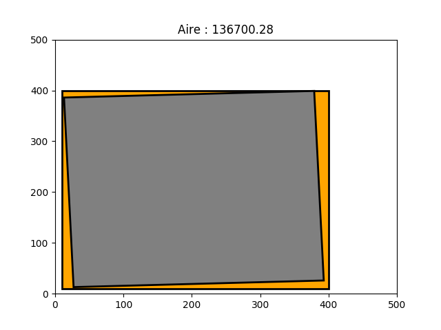
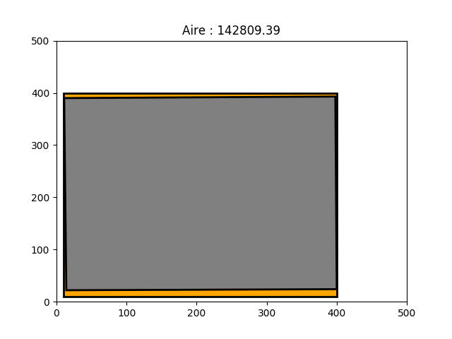
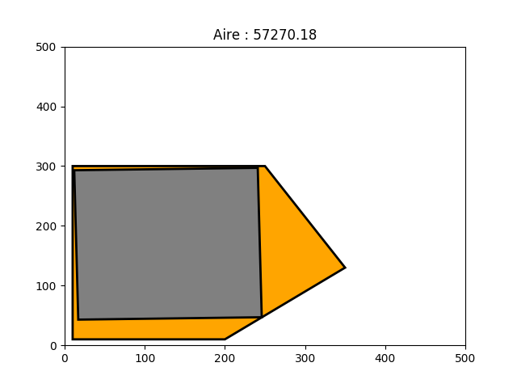
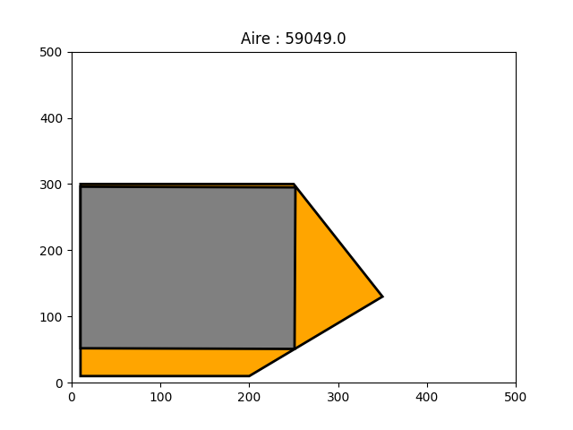
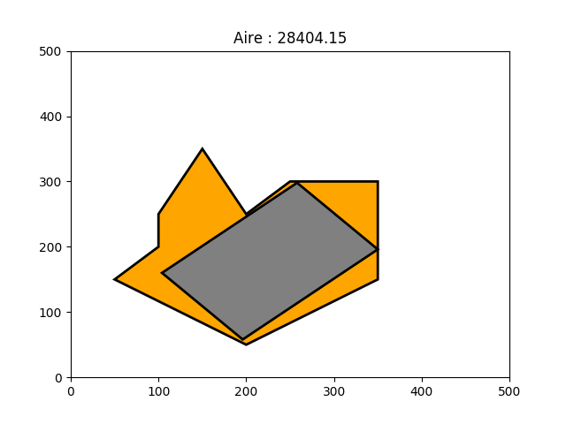
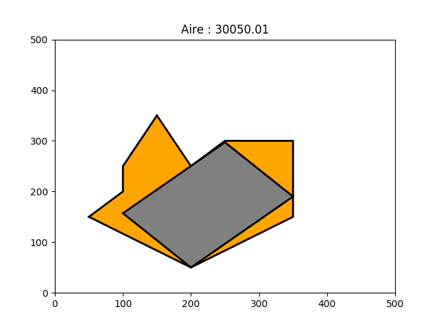
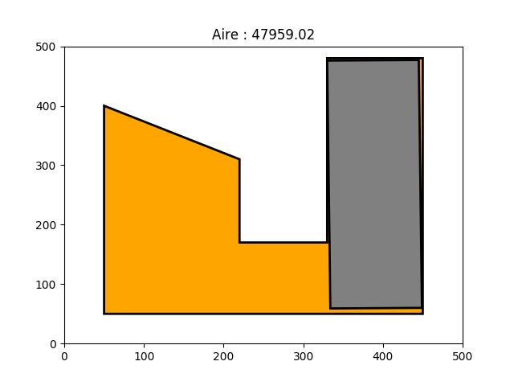
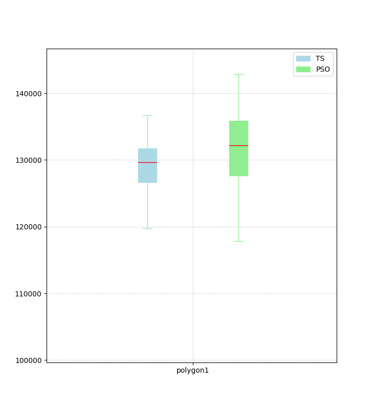
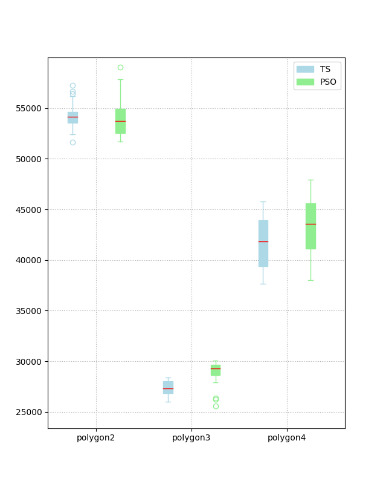

 <h1>Final Project</h1> <i>Course:</i> Heuristics, ADEO-M2  <i>Authors:</i> Alvise de' Faveri Tron, Burak Can Onder

## 1. The problem

The object of this project is to find the rectangle of maximum area (*house*) inside a given polygon (*land*).

## 2. Algorithms Used

For this project we used two different Heuristic algorithms, one single-agent and one multi-agent, to explore the solution space. The two employed algorithms are **Taboo Search** and **Particle Swarm Optimization**.

For both algorithms we employed the `pyclipper` library to check the rectangle's constraints.

### 2.1 Taboo Search

> *File:* ...
> *Usage:* ...

Since taboo search is a single-agent algorithm, we just need one particle to start with. In our case, the first particle is a randomly generated rectangle that fits the polygon's constraints.

Once the initial rectangle is created, we have to decide in which 'direction' of the solution space the agent must move, i.e. which is the next rectangle to be evaluated. To do this, we create the rectangle's *neighborhood* by applying the ... function several times. This function generates a random point in the circle of radius ... from the first rectangle's origin, then generates a fitting rectangle on top of it.

*TODO: add missing information*

Once we have generated the neighborhood, we have to choose the best neighbor, take into account the taboo list, and then the previous rectangle will be put in the taboo list.

*TODO: describe length of the list, optimizations ecc*

### 2.2 Particle Swarm Optimization

> *File:* `surface_multi.py`
> *Usage:* uncomment in the code the polygon to optimize and run the script

For the multi-agent case, we initialize the whole swarm with the `initPop()` function. In this case we chose to populate the swarm with **15** **individuals** and all will have 0 velocity at the beginning. 

We then move each particle according to the PSO rules for a fixed amount of cycle, in this case **2000 cycles**. For moving the particle, we have to redefine the concept of *velocity* for rectangles. The definition is as follows:

* `particle - particle = velocity`: list of the differences between each component of the rectangle representations, *i.e.* A(x,y), O(x,y) and angle.
* `velocity + velocity = velocity`: sum component by component
* `coeff*velocity = velocity`: multiply each component by the coefficient

These operations are implemented in the `move()` function, which computes the velocity and applies is to a particle. The coefficients for the PSO calculations are $\psi = 0.7, \ c_{max} = 1.47$.

Finally, the `update()` function informs every particle of where is the best particle of the swarm, so that it's position will be taken into account in the next iteration.

**2.2.1 Behaviour at Boundaries**

If a particle happens to finish out of the search space, it will be respawned randomly with 0 initial velocity, but it will maintain the memory of the best found solution.

**2.2.2 Local Update**

To improve the algorithm, we can choose to select just a part of the swarm when updating each particle, and compute the best of that subset. For this purpose, we introduced the  `getNeighborhood()` and `localUpdate()` functions. This improvement leaves to the swarm more freedom of movement, so that some subgroups many go far from the rest of the swarm in the solution space. 

## 3. Results

To compare the results, each algorithm has been run 30 times on each polygon. The best result of all attempts for each polygon is displayed in the following table.

| **Polygon** |            **TS**             |          **PSO**          |
| ----------- | :---------------------------: | :-----------------------: |
| Polygon 1   |  |  |
| Polygon 2   |  |  |
| Polygon 3   |  |  |
| Polygon 4   |  |  |
|             |                               |                           |

## Comparison

In order to compare the two algorithms, we have to choose an appropriate number of cycles for each algorithm. In particular, we want to have the same number of solutions evaluated for each algorithm, which is $N_{ts} = N_{cycles} \times N_{neighbors}$ for taboo search and $N_{pso} = N_{cycles} \times N_{particles}$ for PSO.

For TS we chose 1000 iterations and 30 neighbors to test each time, while for PSO we chose 15 particles and 2000 iterations. We ran each algorithm 30 times for each polygon, and then plotted side by side the mean and the median of the best solutions found in the following figure.

| **Barplots of the best evaluations of each polygon**         |                                                              |
| ------------------------------------------------------------ | ------------------------------------------------------------ |
|  |  |

As we can see, the PSO algorithm generally provides the highest maximum value for each polygon, but it has also a greater standard deviation. The mean seem to depend on the initial figure, meaning that the different algorithms perform differently in average, depending on how the search space is configured. 